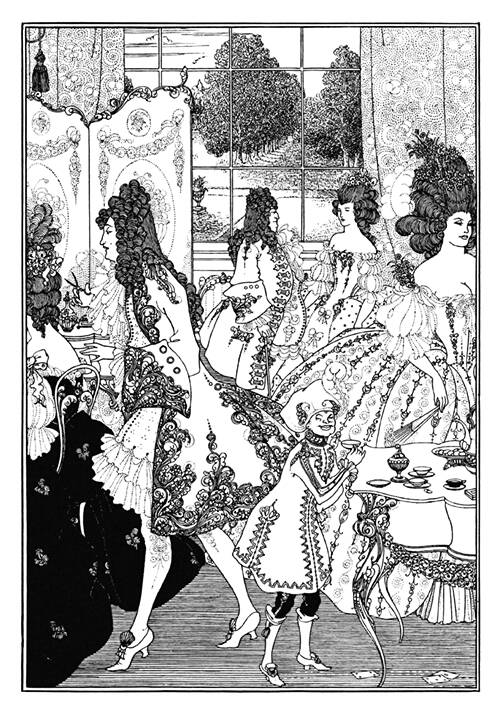

# Digital Garden

> A personal blog, portfolio, and digital garden built with React, TypeScript, and Vite.



---

## Tech Stack

| Layer | Choice |
|-------|--------|
| Framework | React 19 + TypeScript |
| Build | Vite 8 + rolldown |
| Styling | Tailwind CSS 4 (custom design tokens) |
| Animation | motion (framer-motion v12) |
| Routing | react-router-dom v7 |
| Syntax Highlighting | react-syntax-highlighter (Prism + oneDark) |
| Math | KaTeX via rehype-katex |
| Deployment | GitHub Pages (via GitHub Actions) |

## Quick Start

```bash
npm install
npm run dev          # → http://localhost:3001
npm run build        # → dist/
npm run lint         # TypeScript type check
npm run preview      # Preview production build
```


## License

This work is licensed under [CC BY 4.0](https://creativecommons.org/licenses/by/4.0/).

## Credits

- Vintage illustrations from [Old Book Illustrations](https://www.oldbookillustrations.com)


